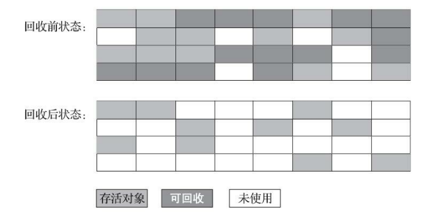

# Java虚拟机

### 运行时数据区

#### 程序计数器（program counter）

线程私有，它可以看作是当前线程所执行的字节码的行号指示器。java虚拟机的多线程是通过线程轮流切换并分配处理器执行时间的方式来实现的，在任意一个确定的时刻，一个处理器都只会执行一条线程中的指令，如果线程正在执行的方法是一个java方法，那程序计数器就保存Java虚拟机正在执行的字节码指令的地址，如果该方法是native的，那程序计数器的值为undefined。程序计数器的容量至少应当能保存一个returnAddress类型的数据或许一个与平台相关的本地指针的值。并且此内存区域是唯一一个没有规定任何OutOfMemoryError情况的区域。

#### Java堆

Java堆可供各个线程共享的运行时内存区域，所有的对象实例以及数组都要在堆对上分配，但随着JIT编译器的发展与逃逸分析技术逐渐成熟，栈上分配，标量替换优化技术将会导致一些微妙的变化发生所有的对象都分配在堆上也逐渐变得不那么“绝对了”。此区域在虚拟机启动时被创建。Java堆的容量可以是固定的，也可以随着程序执行的需求动态扩展，并在不需要过多空间时自动伸缩。Java堆所使用的内存不需要保证是连续的。

可能出现的异常：

1. 如果实际所需的堆超过了自动内存管理系统能提供的最大容量，那虚拟机将会抛出OutOfMemoryError异常。

#### 方法区

方法区是可供各个线程共享的运行时内存区域。他存储了每个类的结构信息，例如运行时常量池，字段和方法数据，构造方法和普通方法的字节码内容，还包括一些在类、实例、接口初始化时用到的特殊方法。在虚拟机启动时被创建，虽然方法区是堆的逻辑组成部分，但是简单的虚拟机实现可以选择在这个区域不实现垃圾收集和压缩。Java8中的虚拟机规范也不限定实现方法区的内存位置和编译代码的管理策略。方法区的容量可以是固定的，也可以随着程序执行的需求动态扩展，并在不需要过多空间时自动收缩，方法区在实际内存空间中可以是不连续的。

可能抛出非异常

1. 如果方法区的内存空间不能满足内存分配请求，那么虚拟机将抛出OutOfMemoryError异常

#### 虚拟机栈

线程私有，与线程同时创建，用于存储帧栈(存储局部变量和一些尚未计算好的结果)，帧栈可以在堆中分配，所使用的内存不需要保证连续。Java虚拟机规范即允许Java虚拟机栈实现固定大小，也允许根据计算动态扩展。

可能出现的异常：

1. 如果线程请求的栈深度大于虚拟机允许的深度，将会抛出Stack OverflowError异常。
2. 如果Java虚拟机栈可以动态扩展，并且在尝试扩展的时候无法申请到足够的内存，或者在创建新的线程时没有足够的内存去创建虚拟机栈，那么虚拟机将会抛出OutOfMemoryError异常。

#### 运行时常量池

运行时常量池是方法区的一部分，Class文件中除了有类非版本、字段、方法、接口等描述信息外，还有一项是常池，用于存放编译期生成的各种字面量的符号引用，这部分内容将会在类加载进入方法区的运行时常量池中存放。
与Class常量池的区别：

1. Java虚拟机对Class文件每一部分（自然也包括常量池）的格式都有严格要求，对于运行时常量池Java虚拟机没有做任何的细节要求。
2. 运行时常量池具有动态性，可以使用String类的intern()方法动态将常量加入常量池中。

可能抛出的异常

1. 当创建类或接口时，如果构造运行时常量池所需的内存空间超过了方法区所能提供的最大值，那么虚拟机将抛出OutOfMemoryError异常

#### 本地方法栈

本地方法栈与与虚拟机栈锁发生的作用是非常类似的，他两的区别是java虚拟机为执行java方法服务，而本地方法栈则为native方法服务，在Sun HotSpot虚拟机中直接将Java虚拟机栈和本地方法栈合二为一。
本地方法栈也会抛出Stack OverflowError和OutOfMemoryError异

#### 栈帧

栈帧是用来存储数据和部分过程结果的数据结构，同时也用来处理动态链接、方法返回、和异常分派。栈帧随着方法调用而创建。随着方法结束而销毁--无论方法是正常完成还是异常完成都算方法结束。帧栈的存储空间由创建它的线程分配在Java虚拟机栈之中。每个栈帧都有自己的本地变量表、操作数栈和指向当前方法所属的类的运行时常量池的引用。

  本地变量表和操作数栈的容量在编译器确定，并通过相关方法的code属性保存及提供给栈帧使用

  在某条线程执行过程中的某个时间点上，只有目前正在执行的那个方法的栈帧是活动的，这个帧栈称为当前帧栈，这个帧栈对应的方法称为当前方法，定义这个方法的类叫做当前类

  如果当前方法调用了其他方法，或者当前方法执行结束，那这个方法的栈帧就不再是当前栈帧了，调用新方法时，新的栈帧也会随之创建，并且会随着程序控制权移交到新方法二成为新的当前栈帧，方法返回之际、当前栈帧会传回此方法的执行结果给前一个栈帧，然后，虚拟机会丢弃当前栈帧，是的前一个栈帧重新成为当前栈帧。

##### 局部变量表

每个栈帧内部包含一组称为局部变量表的变量列表，帧栈中局部变量表的长度有编译期决定，并存储与类或接口的二进制表示之中，即通过方法的code属性保存及提供给栈帧使用。

  局部变量使用索引来进行定位访问。其实索引值为0，long和double类型的数据类型占用两个连续的局部变量，这两种类型的数据值采用局部变量中较小定位索引来定位。

  Java虚拟机使用局部变量表来完成方法调用时的参数传递，

##### 操作数栈

每个栈帧内部都包含一个称为操作数栈的后进先出的栈，帧栈中操作数栈的最大深度由编译期决定，并且通过方法的code保存及提供给栈帧使用。

  栈帧在刚刚创建时，操作数栈时空的。Java虚拟机提供一些字节码指令来从局部变量表或对象实例的字段中复制变量值到操作数栈中，也提供了一些指令用于从操作数栈中取走数据。操作数据以及把操作结果重新入栈。在调用方法时，操作数栈也用于准备调用方法的参数列表以及接收方法返回结果。

  在任意时刻，操作数栈都会有一个确定的栈深度，一个long或double类型的数据会占用两个单位的栈深度，其他数据类型则会占用一个单位的栈深度。

##### 动态链接

每个栈帧内部都包含一个执行当前方法所在的类型的运行时常量池的引用，以便对当前方法的代码实现动态链接。在class文件里面，一个方法若要调用其他方法，或者访问成员变量，则需要通过符号应用来表示，动态链接的作用就是将这些符号应用所表示的方法转换为对实际方法的引用。在类加载过程中将要解析尚未被解析的符号引用，并且将对变量的访问转化为变量在程序运行时，位于存储结构中的正确偏移量。

#### 直接内存

直接内存（Direct Memory）并不是虚拟机运行时数据区的一部分，也不是《Java虚拟机规范》中 定义的内存区域。在JDK 1.4中新加入了NIO（New Input/Output）类，引入了一种基于通道（Channel）与缓冲区 （Buffer）的I/O方式，它可以使用Native函数库直接分配堆外内存，然后通过一个存储在Java堆里面的 DirectByteBuffer对象作为这块内存的引用进行操作，避免了 在Java堆和Native堆中来回复制数据。本机直接内存的分配不会受到Java堆大小的限制，但受限机器的物理内存大小，分配堆大小时需l预留直接内存大小。

可能出现的异常：

1. 如果内存物理内存不足时，动态扩展时出现 OutOfMemoryError异常。

### 对象已死吗？

#### 引用计数算法

 给对象添加一个引用计数器，每当有一个地方引用它，计数器值就加1，当引用失效时，计数器就减1，当计数器为0时表示没有其他对象在引用它。

  缺点：很难解决对象间的循环引用问题。

#### 可达性分析算法

通过 一系列称为“GC Roots”的根对象作为起始节点集，从这些节点开始，根据引用关系向下搜索，搜索过 程所走过的路径称为“引用链”（Reference Chain），如果某个对象到GC Roots间没有任何引用链相连， 或者用图论的话来说就是从GC Roots到这个对象不可达时，则证明此对象是不可能再被使用的。

在Java技术体系里面，固定可作为GC Roots的对象包括以下几种：

1. 在虚拟机栈（栈帧中的本地变量表）中引用的对象，譬如各个线程被调用的方法堆栈中使用到的 参数、局部变量、临时变量等。

2. 在方法区中类静态属性引用的对象，譬如Java类的引用类型静态变量。

3. 在方法区中常量引用的对象，譬如字符串常量池（String Table）里的引用。 ·在本地方法栈中JNI（即通常所说的Native方法）引用的对象。
4. 在本地方法栈中JNI（即通常所说的Native方法）引用的对象。

5. Java虚拟机内部的引用，如基本数据类型对应的Class对象，一些常驻的异常对象（比如 NullPointExcepiton、OutOfMemoryError）等，还有系统类加载器。

6. 所有被同步锁（synchronized关键字）持有的对象。

7. 反映Java虚拟机内部情况的JMXBean、JVMTI中注册的回调、本地代码缓存等。

除了这些固定的GC Roots集合以外，根据用户所选用的垃圾收集器以及当前回收的内存区域不 同，还可以有其他对象“临时性”地加入，共同构成完整GC Roots集合。

### 垃圾收集算法

##### 分代收集理论

1. 弱分代假说（Weak Generational Hypothesis）：绝大多数对象都是朝生夕灭的。
2. 强分代假说（Strong Generational Hypothesis）：熬过越多次垃圾收集过程的对象就越难以消 亡。
3. 跨代引用假说（Intergenerational Reference Hypothesis）：跨代引用相对于同代引用来说仅占极 少数。

##### 标记-清除（Mark-Sweep）算法

 算法分为“标记”和“清除”两个阶段：首先标记出所有需要回 收的对象，在标记完成后，统一回收掉所有被标记的对象，也可以反过来，标记存活的对象，统一回 收所有未被标记的对象

​                                                      

缺点：

1. 是执行效率不稳定，如果Java堆中包含大量对 象，而且其中大部分是需要被回收的，这时必须进行大量标记和清除的动作，导致标记和清除两个过 程的执行效率都随对象数量增长而降低
2. 内存空间的碎片化问题，标记、清除之后会产生大 量不连续的内存碎片，空间碎片太多可能会导致当以后在程序运行过程中需要分配较大对象时无法找 到足够的连续内存而不得不提前触发另一次垃圾收集动作

#####  标记-复制算法

它将可用 内存按容量划分为大小相等的两块，每次只使用其中的一块。当这一块的内存用完了，就将还存活着 的对象复制到另外一块上面，然后再把已使用过的内存空间一次清理掉

缺点：

1. 将可用内存缩小为了原来的一半，空间浪费太多
2. 如果内存中多数对象都是存 活的，这种算法将会产生大量的内存间复制的开销
3. 

##### 标记-整理算法

首先标记出所有需要回 收的对象，在标记完成后，是让所有存活的对象都向内存空间一端移动，然后直接清理掉边界以外的内存。标记-清除算法与标记-整理算法的本质差异在于前者是一种非移动式的回收算法，而后者是移动式的。

1. 在老年代这种每次回收都有大量对象存活区域，移动存活对象并更新 所有引用这些对象的地方将会是一种极为负重的操作
2. 对象移动操作必须全程暂停用户应用 程序才能进行

### 经典垃圾收集器

如果两个收集器之间存在连线，就说明它们可以搭配使用（这个关系不是一成不变的，由于维护和兼容性测试的成本，在JDK 8时将Serial+CMS、 ParNew+Serial Old这两个组合声明为废弃（JEP 173），并在JDK 9中完全取消了这些组合的支持（JEP 214）。）

#### Serial收集器

Serial收集器是一个单线程工作的收集器。但它的“单线 程”的意义并不仅仅是说明它只会使用一个处理器或一条收集线程去完成垃圾收集工作，更重要的是强 调在它进行垃圾收集时，必须暂停其他所有工作线程，直到它收集结束。

​                                  

Serial收集器对于运行在客户端模式下的虚拟机来说是一个很好的选择

#### ParNew收集器

​    ParNew收集器实质上是Serial收集器的多线程并行版本，除了同时使用多条线程进行垃圾收集之外，其余的行为包括Serial收集器可用的所有控制参数、收集算法、Stop The World、对象分配规 则、回收策略等都与Serial收集器完全一致。

​    它默认开启的收集线程数与处理器核心数量相同，在处理器核心非常多，可以使用-XX：ParallelGCThreads参数来限制垃圾收集的线程数。自JDK 9开始，ParNew加CMS收集器的组合就不再是官方推荐的服务端模式下的收集器解决方案了。官方希望它能完全被G1所取代，甚至还取消了ParNew加 Serial Old以及Serial加CMS这两组收集器组合的支持，并直接取消了XX:+UseParNewGC参数，这意味着ParNew和CMS从此只能互相搭配使用，再也没有其他收集器能够和它们配合了。

### Java虚拟机命令行工具

1. jps 查看虚拟机内的进程 命令格式 jps [optins] [hostid]

| 选项 | 作用                                           |
| ---- | ---------------------------------------------- |
| -q   | 只输出LVMID,省略主类的名称                     |
| -m   | 输出虚拟机进程启动时传输给主类main()函数的参数 |
| -v   | 输出虚拟机进程启动时JVM参数                    |

2. jstat 监视虚拟机各种运行时状态信息 命令格式 jstat [options vmid [interval [s|ms] [count] ] ],如果是本地虚拟机进程，vmid与lvmid是一致的.如果是远程虚拟机进程，那vmid的格式应该是 [protocol:][//]lvimd[@hostname[:port]/servername]

| 选项              | 作用                                                         |
| ----------------- | ------------------------------------------------------------ |
| -class            | 监视类装载、卸载数量、总空间以及类装载所耗费时间             |
| -gc               | 监视java堆状况包括Eden区，两个survivor区、老年代、永久代、已用空间、GC时间合计等信息 |
| -gccapacity       | 监视内容与-gc相同，但输出主要关注java堆各个区域使用到的最大、最小空间 |
| -gcutil           | 监视内容与-gc相同.但输出只要关注已使用空间占总空间的百分比   |
| -gccause          | 与gcutil功能一样，但是会额外输出导致上次GC产生的原因         |
| -gcnew            | 监视新生代GC状况                                             |
| -gcnewcapacity    | 监视内容与gcnew基本相同，但输出主要关注使用到的最大、最小空间 |
| -gcold            | j监视老年代GC情况                                            |
| -gcoldcapacity    | 监视内容与gcold基本相同，但输出主要关注使用到的最大、最小空间 |
| -gcpermcapacity   | 输出永久代使用的最大、最小空间                               |
| -compiler         | 输出JIT编译器编译过的方法、耗时等                            |
| -printcompilation | 输出已经被JIT编译的方法                                      |

3. jinfo 实时查看和调整虚拟机各项参数
4. jmap  用于生成对转存快照 命令格式 jmap [option] vmid

| 选项          | 作用                                                         |
| ------------- | ------------------------------------------------------------ |
| -dump         | 生成java堆转存快照，格式：-dump:[live,] format=b,file=<filename>,其中live子参数说明是否只dump出存活对象 |
| -finalzerinfo | 显示在F-Queue中等待Finalizer线程执行finalize方法的对象，只在Linux/Solaris平台有效 |
| -heap         | 显示Java堆详细信息如使用哪种回收器、参数配置、分代状况等     |
| -histo        | 显示堆中对象统计信息。包括类、实例数量、合计容量             |
| -permstat     | 以ClassLoder为统计口径显示永久代内存状态                     |
| -F            | 当虚拟机进程对-dump选项没有响应时，可以使用这个选项强制生成dump快照 |

5. jhat 虚拟机堆转储快照分析工具
6. jstack java堆栈跟踪工具 命令格式 jstack [option] vmid

| 选项 | 作用                                        |
| ---- | ------------------------------------------- |
| -F   | 当正常输出请求不被响应时，强制输出线程堆栈  |
| -l   | 出堆栈外，显示关于锁的附加信息              |
| -m   | 如果调用到本地方法的话，可以显示c/c++的堆栈 |
