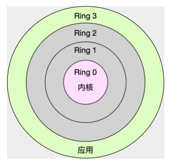

#### 平均负载

平均负载是指单位时间内，系统处于可运行状态和不可中断状态的平均进程数，也就 是平均活跃进程数。

可运行状态的进程，是指正在使用 CPU 或者正在等待 CPU 的进程，也就是我们常用 ps 命 令看到的，处于 R 状态（Running 或 Runnable）的进程。

不可中断状态的进程则是正处于内核态关键流程中的进程，并且这些流程是不可打断的，比如最 常见的是等待硬件设备的 I/O 响应，也就是我们在 ps 命令中看到的 D 状态（Uninterruptible Sleep，也称为 Disk Sleep）的进程（不可中断状态实际上是系统对进程和硬件设备的一种保护机制）

##### 平均负载为多少时合理

  平均负载最理想的情况是等于 CPU 个数。查看有多少个cpu可以使用命令top或 ` grep 'model name' /proc/cpuinfo | wc -l`。

查询系统平均负载命令用uptime

`$ uptime `

`02:34:03 当前时间`

`up 2 days , 20:14, 系统运行时间`

` 1 user, 正在登陆的用户数` 

` load average: 0.63, 0.83, 0.88 过去 1 分钟、5 分钟、15 分钟的平均负载`

假设我们在一个单 CPU 系统上看到平均负载为 1.73，0.60，7.98，那么说 明在过去 1 分钟内，系统有 73% 的超载，而在 15 分钟内，有 698 % 的超载。

那么，在实际生产环境中，平均负载多高时，需要我们重点关注呢？

当平均负载高于 CPU 数量 70% 的时候，你就应该分析排查负载高的问题了。一旦 负载过高，就可能导致进程响应变慢，进而影响服务的正常功能。

##### 平均负载与 CPU 使用率

平均负载它不仅包括了正在使用 CPU 的进程，还包括等待 CPU 和等待 I/O 的进程。

CPU 使用率，是单位时间内 CPU 繁忙情况的统计。

- CPU 密集型进程，使用大量 CPU 会导致平均负载升高，此时这两者是一致的。
- I/O 密集型进程，等待 I/O 也会导致平均负载升高，但 CPU 使用率不一定很高。
- 大量等待 CPU 的进程调度也会导致平均负载升高，此时的 CPU 使用率也会比较高。

#### CPU 上下文切换

Linux 是一个多任务操作系统，它支持远大于 CPU 数量的任务同时运行。当然， 这些任务实际上并不是真的在同时运行，而是因为系统在很短的时间内，将 CPU 轮流分配给它 们，造成多任务同时运行的错觉。而在每个任务运行前，CPU 都需要知道任务从哪里加载、又从哪里开始运行，也就是说，需要 系统事先帮它设置好 CPU 寄存器和程序计数器。

CPU 上下文切换，就是先 把前一个任务的 CPU 上下文（也就是 CPU 寄存器和程序计数器）保存起来，然后加载新任务 的上下文到这些寄存器和程序计数器，最后再跳转到程序计数器所指的新位置，运行新任务。

根据任务的不同，CPU 的上下文切换就可以分为进程上下文切 换、线程上下文切换以及中断上下文切换

##### 进程上下文切换

Linux 按照特权等级，把进程的运行空间分为内核空间和用户空间，分别对应着下图中， CPU 特权等级的 Ring 0 和 Ring 3。

​                                                              

- 内核空间（Ring 0）具有最高权限，可以直接访问所有资源；
- 用户空间（Ring 3）只能访问受限资源，不能直接访问内存等硬件设备，必须通过系统调用 陷入到内核中，才能访问这些特权资源。

换个角度看，也就是说，进程既可以在用户空间运行，又可以在内核空间中运行。进程在用户空 间运行时，被称为进程的用户态，而陷入内核空间的时候，被称为进程的内核态。

从用户态到内核态的转变，需要通过系统调用来完成。CPU 寄存器里原来用户态的指令位置，需要先保存起来。接着，为了执行内核态代码，CPU 寄 存器需要更新为内核态指令的新位置。最后才是跳转到内核态运行内核任务。 而系统调用结束后，CPU 寄存器需要恢复原来保存的用户态，然后再切换到用户空间，继续运 行进程。所以，**一次系统调用的过程，其实是发生了两次 CPU 上下文切换**。

不过，需要注意的是，系统调用过程中，并不会涉及到虚拟内存等进程用户态的资源，也不会切换进程。这跟我们通常所说的进程上下文切换是不一样的：

-  进程上下文切换，是指从一个进程切换到另一个进程运行。
- 而系统调用过程中一直是同一个进程在运行。

所以，系统调用过程通常称为特权模式切换，而不是上下文切换。但实际上，系统调用过程中， CPU 的上下文切换还是无法避免的。

进程上下文切换跟系统调用又有什么区别呢？

 进程是由内核来管理和调度的，进程的切换只能发生在内核态。所以，进程 的上下文不仅包括了虚拟内存、栈、全局变量等用户空间的资源，还包括了内核堆栈、寄存器等 内核空间的状态。因此，进程的上下文切换就比系统调用时多了一步：在保存当前进程的内核状态和 CPU 寄存器 之前，需要先把该进程的虚拟内存、栈等保存下来；而加载了下一进程的内核态后，还需要刷新 进程的虚拟内存和用户栈。

什么时候会切换进程上下文？

只有在进程调度的时候，才需要切换上下文。 Linux 为每个 CPU 都维护了一个就绪队列，将活跃进程（即正在运行和正在等待 CPU 的进程） 按照优先级和等待 CPU 的时间排序，然后选择最需要 CPU 的进程，也就是优先级最高和等待 CPU 时间最长的进程来运行。

进程在什么时候才会被调度到 CPU 上运行呢？

1. 为了保证所有进程可以得到公平调度，CPU 时间被划分为一段段的时间片，这些时间片 再被轮流分配给各个进程。这样，当某个进程的时间片耗尽了，就会被系统挂起，切换到其它正 在等待 CPU 的进程运行。
2. 进程在系统资源不足（比如内存不足）时，要等到资源满足后才可以运行，这个时候进程 也会被挂起，并由系统调度其他进程运行。
3. 当进程通过睡眠函数 sleep 这样的方法将自己主动挂起时，自然也会重新调度。
4. 当有优先级更高的进程运行时，为了保证高优先级进程的运行，当前进程会被挂起，由高 优先级进程来运行。
5. 发生硬件中断时，CPU 上的进程会被中断挂起，转而执行内核中的中断服务程序。

