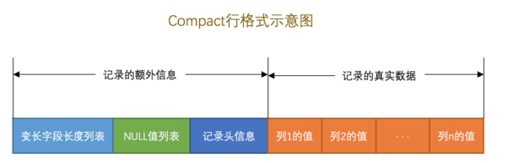
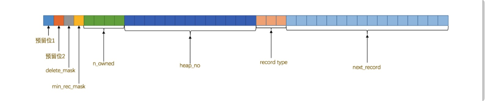
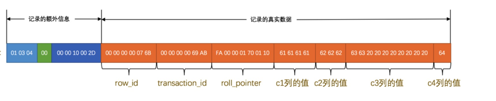

### InnoDB行格式

存放记录的方式叫做行格式或记录格式，InnoDB设计了4种不同类型的 行格式 ，分别是 Compact 、 Redundant 、 Dynamic 和 Compressed 行格式

#####  指定行格式的语法

​      我们可以在创建或修改表的语句中指定 行格式 ： 

​     CREATE TABLE 表名 (列的信息) ROW_FORMAT=行格式名称

​     ALTER TABLE 表名 ROW_FORMAT=行格式名称

#####  COMPACT行格式

​              一条完整的记录其实可以被分为 **记录的额外信息** 和 **记录的真实数据** 两部分

###### 变长字段长度列表

   变长字段中存储多少字节的数据是不固定的，所以我们在存储真实数据的时候需要顺便把这些数据占用的字节数也存起来。
因此变长字段的占用的存储空间为：**真正的数据内容+占用的字节数**

   在 Compact 行格式中，把所有变长字段的真实数据占用的字节长度都存放在记录的开头部位，从而形成一个变长 字段长度列表，各变长字段数据占用的字节数按照列的顺序**逆序**存放

​    如何确定用1个还是2个字节来 表示真实数据占用的字节数？InnoDB 有它的一套规则，我们首先声明一下 W 、 M 和 L 的意思

1. 假设某个字符集中表示一个字符最多需要使用的字节数为 W ，也就是使用 SHOW CHARSET 语句的结果中的 Maxlen 列，比方说 utf8 字符集中的 W 就是 3 ， gbk 字符集中的 W 就是 2 ， ascii 字符集中的 W 就是 1 。
2.   对于变长类型 VARCHAR(M) 来说，这种类型表示能存储最多 M 个字符（注意是字符不是字节），所以这个类型能表示的字符串最多占用的字节数就是 M×W 。
3.  假设它实际存储的字符串占用的字节数是 L 。

确定用1个还是2个字节来 表示真实数据占用的字节数规则如下：

- 如果 M×W <= 255 ，那么使用1个字节来表示真正字符串占用的字节数。

  > ​       也就是说InnoDB在读记录的变长字段长度列表时先查看表结构，如果某个变长字段允许存储的最 大字节数不大于255时，可以认为只使  用1个     字节来表示真正字符串占用的字节数。

- 如果 M×W > 255 ，则分为两种情况： 

​            如果 L <= 127 ，则用1个字节来表示真正字符串占用的字节数。

​            如果 L > 127 ，则用2个字节来表示真正字符串占用的字节数。

> ​        InnoDB在读记录的变长字段长度列表时先查看表结构，如果某个变长字段允许存储的最大字节 数大于255时，该怎么区分它正在读的某个        字节是一个单独的字段长度还是半个字段长度呢？ 设计InnoDB的大叔使用该字节的第一个二进制位作为标志位：如果该字节的第一个位为0，那 该字节就是一个单独的字段长度（使用一个字节表示不大于127的二进制的第一个位都为0）， 如果该字节的第一个位为1，那该字节就是半个字段长度。

> ​     对于一些占用字节数非常多的字段，比方说某个字段长度大于了16KB，那么如果该记录在单个 页面中无法存储时，InnoDB会把一部分数据存放到所谓的溢出页中，在变 长字段长度列表处只存储留在本页面中的长度，所以使用两个字节也可以存放下来。

**总结：如果该可变字段允许存储的最大字节数（ M×W ）超过255字节并且真实存储的字节数（ L ） 超过127字节，则使用2个字节，否则使用1个字节。**

**注意：**

1. **变长字段长度列表中只存储值为 非NULL 的列内容占用的长度，值为 NULL 的列的长度 是不储存的**
2. **如果表中所有的列都不是变长的数据类型的话， 这一部分可省略**

###### NULL 值列表

为节省存储空间Compact 行格式把值为 NULL 的列统一管理起来，存储到 NULL 值列表中。

处理过程是这样的：

1. 首先统计表中允许存储 NULL 的列有哪些
2. 如果表中没有允许存储 NULL 的列，则 NULL值列表 也不存在了，否则将每个允许存储NULL 的列对应一个 二进制位，二进制位按照列的顺序**逆序**排列， 二进制位的值为 1 时，代表该列的值为 NULL ， 二进制位的值为 0 时，代表该列的值不为 NULL 。

3. MySQL 规定 NULL值列表 必须用整数个字节的位表示，如果使用的二进制位个数不是整数个字节，则在字节 的高位补 0（如果一个表中有9个允许为 NULL ，那这个记录的 NULL 值列表部分就需要2个字节来表示） 。

###### 记录头信息

记录头信息是由固定的 5 个字节组成。 5 个字节也就是 40 个二进制位，不同的位代表不同的意思，如图

| 名称         | 大小（单位：bit） | 描述                                                         |
| ------------ | ----------------- | ------------------------------------------------------------ |
| 预留位       | 1                 | 没有使用                                                     |
| 预留位       | 1                 | 没有使用                                                     |
| delete_mask  | 1                 | 标记该记录是否被删除                                         |
| min_rec_mask | 1                 | B+树的每层非叶子节点中的最小记录都会添加该标记               |
| n_owned      | 4                 | 表示当前记录拥有的记录数                                     |
| heap_no      | 13                | 表示当前记录在记录堆的位置信息                               |
| record_type  | 3                 | 表示当前记录的类型， 0 表示普通记录， 1 表示B+树非叶子节点记录， 2 表示最小记录， 3 表示最大记录 |
| next_record  | 16                | 表示下一条记录的相对位置                                     |

###### 记录的真实数据

一行数据除了存储真实数据外，MySQL 会为每个记录默认的添加一些列（也称为 隐藏列 ），如下

| 列名                        | 是否必须 | 占用空间 | 描述                   |
| --------------------------- | -------- | -------- | ---------------------- |
| row_id（DB_ROW_ID）         | 否       | 6 字节   | 行ID，唯一标识一条记录 |
| transaction_id（DB_TRX_ID） | 是       | 6 字节   | 事务ID                 |
| roll_pointer（DB_ROLL_PTR） | 是       | 7字节    | 回滚指针               |

 InnoDB 表对主键的生成策略：优先使用用户自定义主键作为主键，如果用户没有定义主键，则选取一个 Unique 键作为主键，如果表中连 Unique 键都没有定义的话，则 InnoDB 会为表默认添加一个名为 row_id 的隐藏列作为主键，row_id 是可选的（在没有自定义主键以及Unique键的情况下才会添加该列）。

###### CHAR(M)列的存储格式

   对于 CHAR(M) 类型的列来说，当列采用的是定长字符集时，该列占用的字节数不会被加到变长字段长度列表，而如果采用变长字符集时，该列占用的字节数也会被加到变长字段长度列表。

​    变长字符集的 CHAR(M) 类型的列要求至少占用 M 个字节，而 VARCHAR(M) 却没有这个要 求。比方说对于使用 utf8 字符集的 CHAR(10) 的列来说，该列存储的数据字节长度的范围是10～30个字节。即 使我们向该列中存储一个空字符串也会占用 10 个字节，这是怕将来更新该列的值的字节长度大于原有值的字节 长度而小于10个字节时，可以在该记录处直接更新，而不是在存储空间中重新分配一个新的记录空间，导致原有 的记录空间成为所谓的碎片

### InnoDB数据页结构

​    数据页是InnoDB 管理存储空间的基本单位，一个页的大小一般是 16KB

​     

从图中可以看出，一个 InnoDB 数据页的存储空间大致被划分成了 7 个部分，有的部分占用的字节数是确定的， 有的部分占用的字节数是不确定的,，每列代表的含义如下：

| 名称               | 中文名             | 占用空间大小 | 简单描述                 |
| ------------------ | ------------------ | ------------ | ------------------------ |
| File Header        | 文件头部           | 38 字节      | 页的一些通用信息         |
| Page Header        | 页面头部           | 56 字节      | 数据页专有的一些信息     |
| Infimum + Supremum | 最小记录和最大记录 | 26 字节      | 两个虚拟的行记录         |
| User Records       | 用户记录           | 不确定       | 实际存储的行记录内容     |
| Free Space         | 空闲空间           | 不确定       | 页中尚未使用的空间       |
| Page Directory     | 页面目录           | 不确定       | 页中的某些记录的相对位置 |
| File Trailer       | 文件尾部           | 8 字节       | 校验页是否完整           |

#### 记录在页中的存储

在页的7个组成部分中，我们自己存储的记录会按照我们指定的 行格式 存储到 User Records 部分。但是在一开 始生成页的时候，其实并没有 User Records 这个部分，每当我们插入一条记录，都会从 Free Space 部分中申请一个记录大小的空间划分到 User Records 部分，当 Free Space 部分的空间全部 被 User Records 部分替代掉之后，也就意味着这个页使用完了，如果还有新的记录插入的话，就需要去申请新 的页了，这个过程的图示如下：

​       InnoDB根据行格式里的记录头信息来管理 User Records区域

- ​     delete_mask

​       当记录被删除时，记录头信息里的delete_mask属性值改为1，但此时记录仍在当前页中，不立即从磁盘中删除是因为移除 它们之后把其他的记录在磁盘上重新排列需要性能消耗。所有被删除掉的记 录都会组成一个所谓的 垃圾链表 ，在这个链表中的记录占用的空间称之为所谓的 可重用空间 ，之后如果有 新记录插入到表中的话，可能把这些被删除的记录占用的存储空间覆盖掉。 将这个delete_mask位设置为1和将被删除的记录加入到垃圾链表中其实是两个阶段

- heap_no

#### Page Directory（页目录）

为了能得到一个数据页中存储的记录的状态信息，特意在页中定义了一个叫 Page Header 的部分，它是页结构的第二部分，这个部分占用固定的 56 个字节，专门存储各种状态信息。

| 名称              | 占用空间大小 | 描述                                                         |
| ----------------- | ------------ | ------------------------------------------------------------ |
| PAGE_N_DIR_SLOTS  | 2 字节       | 在页目录中的槽数量                                           |
| PAGE_HEAP_TOP     | 2 字节       | 还未使用的空间最小地址，也就是说从该地址之后就是 Free Space  |
| PAGE_N_HEAP       | 2 字节       | 本页中的记录的数量（包括最小和最大记录以及标记为删除的记录） |
| PAGE_FREE         | 2 字节       | 第一个已经标记为删除的记录地址（各个已删除的记录通过 next_record 也会组成一个单链 表，这个单链表中的记录可以被重新利用） |
| PAGE_GARBAGE      | 2 字节       | 已删除记录占用的字节数                                       |
| PAGE_LAST_INSERT  | 2 字节       | 最后插入记录的位置                                           |
| PAGE_DIRECTION    | 2 字节       | 记录插入的方向                                               |
| PAGE_N_DIRECTION  | 2 字节       | 一个方向连续插入的记录数量                                   |
| PAGE_N_RECS       | 2 字节       | 该页中记录的数量（不包括最小和最大记录以及被标记为删除的记录） |
| PAGE_MAX_TRX_ID   | 2 字节       | 修改当前页的最大事务ID，该值仅在二级索引中定义               |
| PAGE_LEVEL        | 2 字节       | 当前页在B+树中所处的层级                                     |
| PAGE_INDEX_ID     | 8 字节       | 索引ID，表示当前页属于哪个索引                               |
| PAGE_BTR_SEG_LEAF | 10 字节      | B+树叶子段的头部信息，仅在B+树的Root页定义                   |
| PAGE_BTR_SEG_TOP  | 10 字节      | B+树非叶子段的头部信息，仅在B+树的Root页定义                 |

#### File Header（文件头部）

File Header 针对各种类型的页都通用，也就是说不同类型的页都会以 File Header 作 为第一个组成部分，它描述了一些针对各种页都通用的一些信息，这个部分占用固定的 38 个字节。

| 名称                             | 占用空间大小 | 描述                                                         |
| -------------------------------- | ------------ | ------------------------------------------------------------ |
| FIL_PAGE_SPACE_OR_CHKSUM         | 4 字节       | 页的校验和（checksum值）                                     |
| FIL_PAGE_OFFSET                  | 4 字节       | 页号（InnoDB 通过页号来可以唯一定位一个页）                  |
| FIL_PAGE_PREV                    | 4 字节       | 上一个页的页号                                               |
| FIL_PAGE_NEXT                    | 4 字节       | 下一个页的页号                                               |
| FIL_PAGE_LSN                     | 8 字节       | 页面被最后修改时对应的日志序列位置（英文名是：Log Sequence Number） |
| FIL_PAGE_TYPE                    | 2 字节       | 该页的类型                                                   |
| FIL_PAGE_FILE_FLUSH_LSN          | 8 字节       | 仅在系统表空间的一个页中定义，代表文件至少被刷新到了对应的LSN值 |
| FIL_PAGE_ARCH_LOG_NO_OR_SPACE_ID | 4 字节       | 页属于哪个表空间                                             |

- FIL_PAGE_TYP

​      InnoDB 为了不同的目的把页分为不同的类型，具体如下表：

| 类型名称                | 十六进制 | 描述                            |
| ----------------------- | -------- | ------------------------------- |
| FIL_PAGE_TYPE_ALLOCATED | 0x0000   | 最新分配，还没使用              |
| FIL_PAGE_UNDO_LOG       | 0x0002   | Undo日志页                      |
| FIL_PAGE_INODE          | 0x0003   | 段信息节点                      |
| FIL_PAGE_IBUF_FREE_LIST | 0x0004   | Insert Buffer空闲列表           |
| FIL_PAGE_IBUF_BITMAP    | 0x0005   | Insert Buffer位图               |
| FIL_PAGE_TYPE_SYS       | 0x0006   | 系统页                          |
| FIL_PAGE_TYPE_TRX_SYS   | 0x0007   | 事务系统数据                    |
| FIL_PAGE_TYPE_FSP_HDR   | 0x0008   | 表空间头部信息                  |
| FIL_PAGE_TYPE_XDES      | 0x0009   | 扩展描述页                      |
| FIL_PAGE_TYPE_BLOB      | 0x000A   | BLOB页                          |
| FIL_PAGE_INDEX          | 0x45BF   | 索引页，也就是我们所说的 数据页 |

- FIL_PAGE_PREV 和 FIL_PAGE_NEXT

 InnoDB 都是以页为单位存放数据的， FIL_PAGE_PREV 和 FIL_PAGE_NEXT可以把分散的多个不连续的页关联起来建立一个双向链表。（并不是所有类型的页都有上一个和下一个页的属性）

​                 

#### File Trailer

为了检测一个页是否完整（也就是在同步的时候有没有发生只同步 一半的尴尬情况），InnoDB 在每个页的尾部都加了一个 File Trailer 部分，这个部分由 8 个字 节组成，可以分成2个小部分：

- 前4个字节代表页的校验和

​        这个部分是和 File Header 中的校验和相对应的。每当一个页面在内存中修改了，在同步之前就要把它的校 验和算出来，因为 File Header 在页面的前边，所以校验和会被首先同步到磁盘，当完全写完时，校验和也 会被写到页的尾部，如果完全同步成功，则页的首部和尾部的校验和应该是一致的。如果写了一半儿断电 了，那么在 File Header 中的校验和就代表着已经修改过的页，而在 File Trialer 中的校验和代表着原先 的页，二者不同则意味着同步中间出了错。

- 后4个字节代表页面被最后修改时对应的日志序列位置（LSN）

​      这个部分也是为了校验页的完整性的

### 快速查询的秘籍-B+树索引
